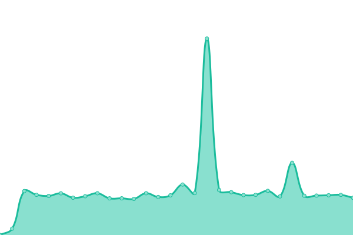
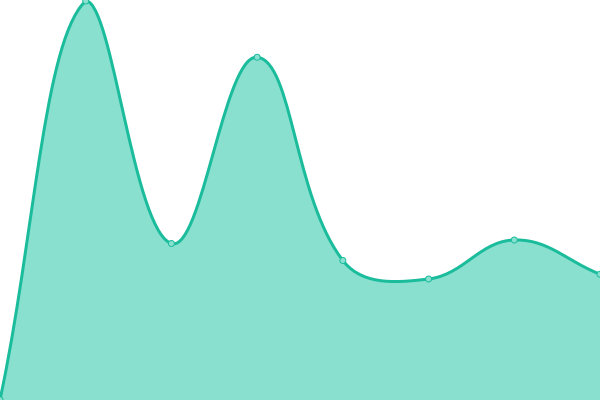
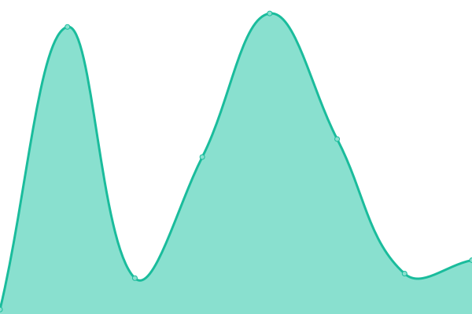
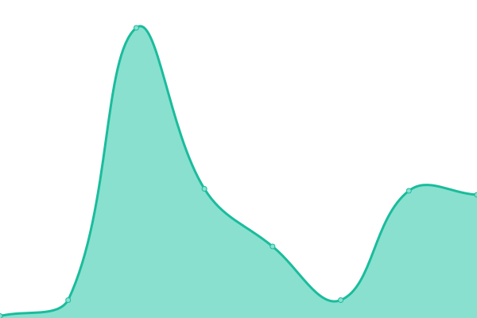
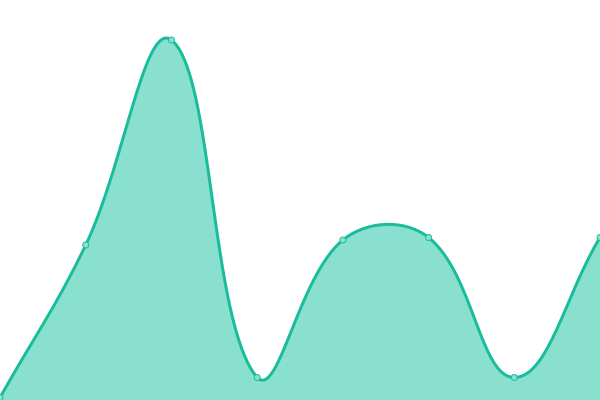
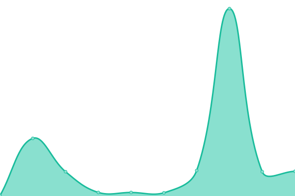
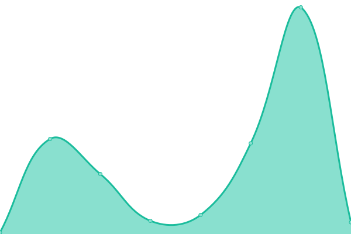
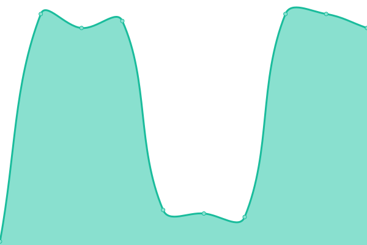
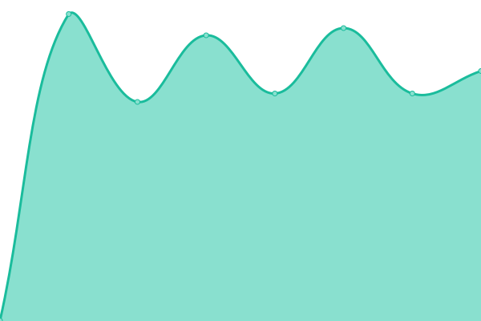
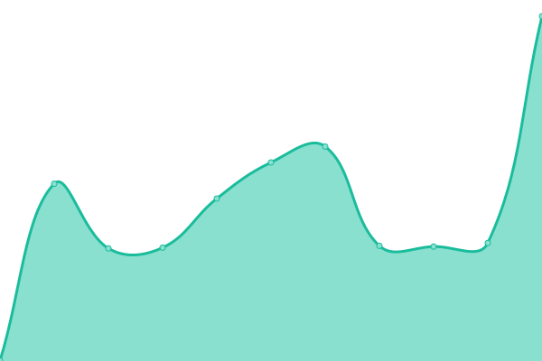

# [📈 Live Status](https://demo.upptime.js.org): <!--live status--> **🟧 Partial outage**

This repository contains the open-source uptime monitor and status page for [Oznorts](https://demo.upptime.js.org), powered by [Upptime](https://github.com/upptime/upptime).

With [Upptime](https://upptime.js.org), you can get your own unlimited and free uptime monitor and status page, powered entirely by a GitHub repository. We use [Issues](https://github.com/Oznorts/uptime/issues) as incident reports, [Actions](https://github.com/Oznorts/uptime/actions) as uptime monitors, and [Pages](https://demo.upptime.js.org) for the status page.

<!--start: status pages-->
<!-- This summary is generated by Upptime (https://github.com/upptime/upptime) -->
<!-- Do not edit this manually, your changes will be overwritten -->
<!-- prettier-ignore -->
| URL | Status | History | Response Time | Uptime |
| --- | ------ | ------- | ------------- | ------ |
|  [Website](https://www.oznorts.com) | 🟥 Down | [website.yml](https://github.com/Oznorts/uptime/commits/HEAD/history/website.yml) | 

 1162ms
     
 | 

<a href="https://Oznorts.github.io/uptime/history/website">99.83%</a>
    

|  [Domain Management](https://reseller.enom.com/interface.asp) | 🟩 Up | [domain-management.yml](https://github.com/Oznorts/uptime/commits/HEAD/history/domain-management.yml) | 

 840ms
     
 | 

<a href="https://Oznorts.github.io/uptime/history/domain-management">100.00%</a>
    

|  [la-s3: cPanel](oznorts.host) | 🟩 Up | [la-s3-c-panel.yml](https://github.com/Oznorts/uptime/commits/HEAD/history/la-s3-c-panel.yml) | 

 61ms
     
 | 

<a href="https://Oznorts.github.io/uptime/history/la-s3-c-panel">100.00%</a>
    

|  [la-s3: HTTPS](146.71.80.108) | 🟩 Up | [la-s3-https.yml](https://github.com/Oznorts/uptime/commits/HEAD/history/la-s3-https.yml) | 

 61ms
     
 | 

<a href="https://Oznorts.github.io/uptime/history/la-s3-https">100.00%</a>
    

|  [la-s3: HTTP](146.71.80.108) | 🟩 Up | [la-s3-http.yml](https://github.com/Oznorts/uptime/commits/HEAD/history/la-s3-http.yml) | 

 62ms
     
 | 

<a href="https://Oznorts.github.io/uptime/history/la-s3-http">100.00%</a>
    

|  [la-s3: Incoming Email](146.71.80.108) | 🟩 Up | [la-s3-incoming-email.yml](https://github.com/Oznorts/uptime/commits/HEAD/history/la-s3-incoming-email.yml) | 

 48ms
     
 | 

<a href="https://Oznorts.github.io/uptime/history/la-s3-incoming-email">98.91%</a>
    

|  [la-s3: Outgoing Email](la-s3.serverpanel.net) | 🟩 Up | [la-s3-outgoing-email.yml](https://github.com/Oznorts/uptime/commits/HEAD/history/la-s3-outgoing-email.yml) | 

 48ms
     
 | 

<a href="https://Oznorts.github.io/uptime/history/la-s3-outgoing-email">99.11%</a>
    

|  [la-s3: FTP](146.71.80.108) | 🟩 Up | [la-s3-ftp.yml](https://github.com/Oznorts/uptime/commits/HEAD/history/la-s3-ftp.yml) | 

 64ms
     
 | 

<a href="https://Oznorts.github.io/uptime/history/la-s3-ftp">99.16%</a>
    

|  [Third-Party Addons: SpamExperts Dashboard](https://login.antispamcloud.com) | 🟩 Up | [third-party-addons-spam-experts-dashboard.yml](https://github.com/Oznorts/uptime/commits/HEAD/history/third-party-addons-spam-experts-dashboard.yml) | 

 2229ms
     
 | 

<a href="https://Oznorts.github.io/uptime/history/third-party-addons-spam-experts-dashboard">100.00%</a>
    

|  [Third-Party Addons: Uptime Monitor](http://uptime.oznorts.com) | 🟩 Up | [third-party-addons-uptime-monitor.yml](https://github.com/Oznorts/uptime/commits/HEAD/history/third-party-addons-uptime-monitor.yml) | 

 362ms
     
 | 

<a href="https://Oznorts.github.io/uptime/history/third-party-addons-uptime-monitor">98.87%</a>
    

<!--end: status pages-->

[**Visit our status website →**](https://demo.upptime.js.org)

## 📄 License

- Powered by: [Upptime](https://github.com/upptime/upptime)
- Code: [MIT](./LICENSE) © [Anand Chowdhary](https://anandchowdhary.com), supported by [Pabio](https://pabio.com)
- Data in the `./history` directory: [Open Database License](https://opendatacommons.org/licenses/odbl/1-0/)
